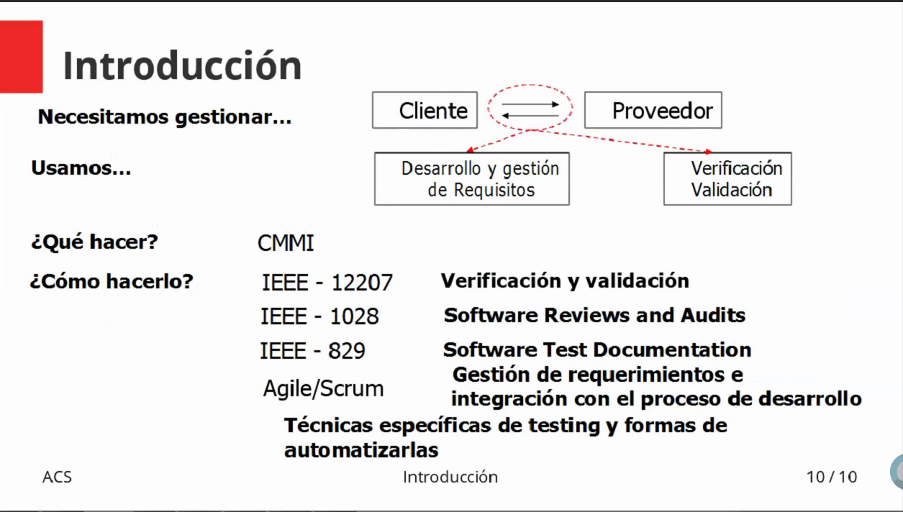
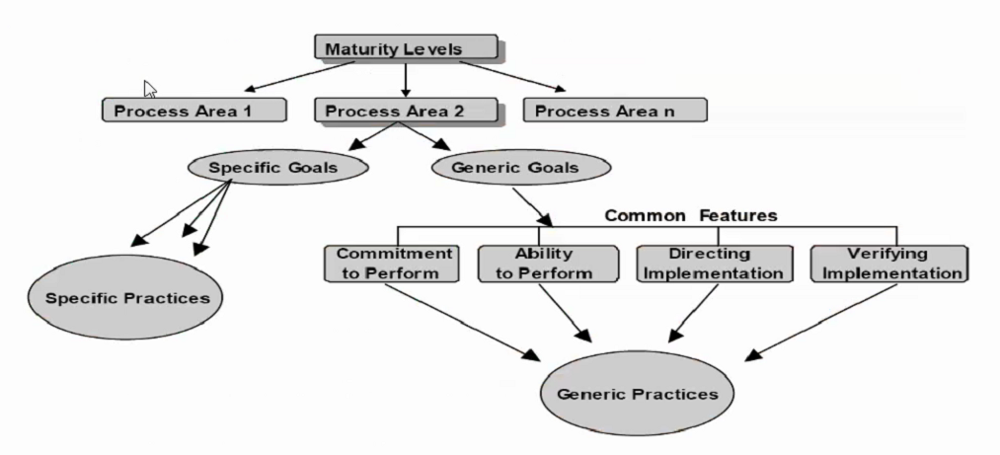
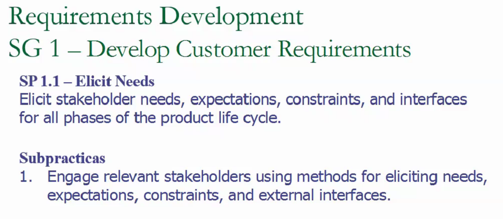
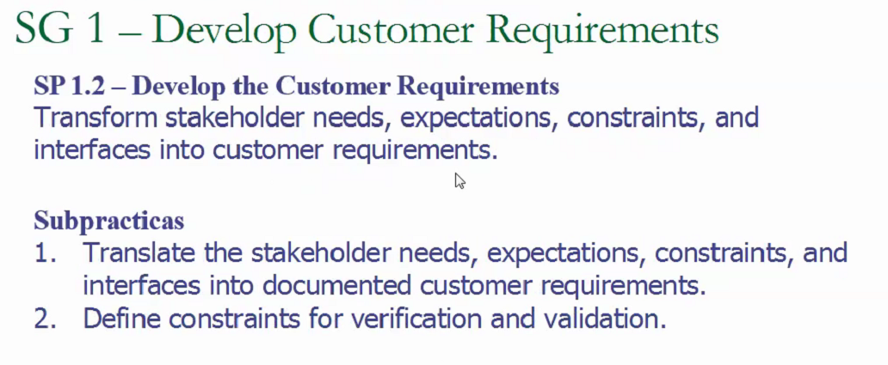
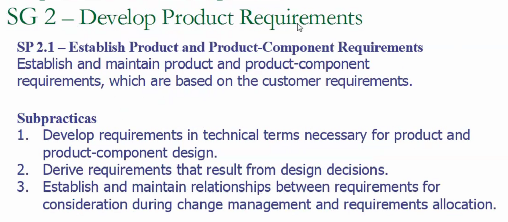
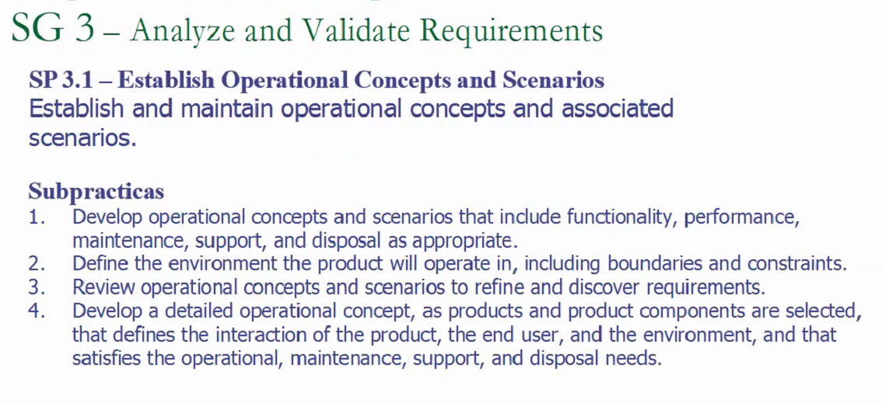
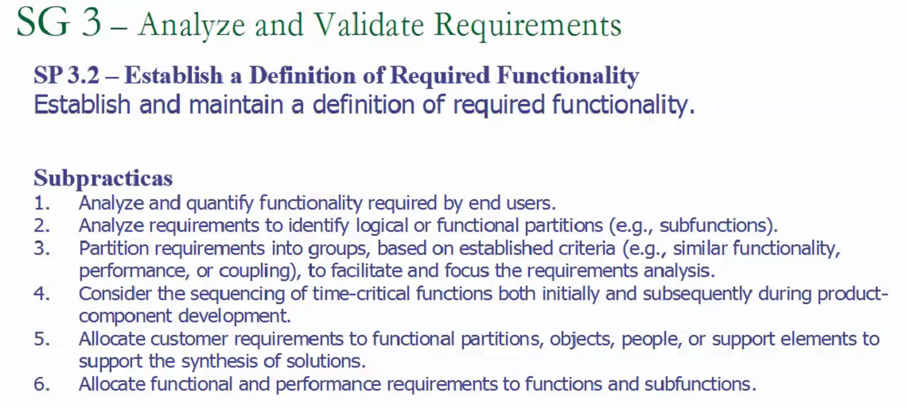
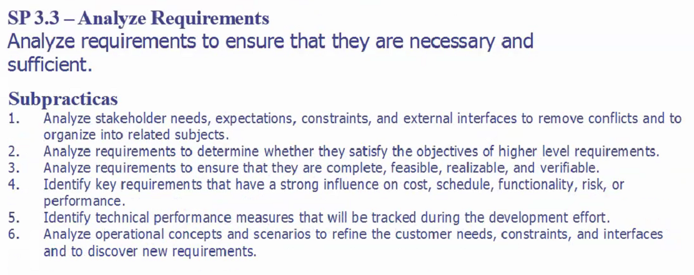

# Aseguramiento de la calidad del software

## Calidad

La calidad depende del contexto y el uso pretendido

### Según la Real Academia Española

- Propiedad o conjunto de propiedades inherentes a algo, que permiten juzgar su valor
- Adeucación de un producto o servicio a las características especificadas
- Condición o requisito que se pone en un contrato

### Según el CMMI

- Otra cosa

### Según la IEEE 610

- Otra

### Según la ISO

- Otra cosa mas

### Desarrollo y gestión de requisitos

Debemos poder bajar las expectativas a requisitos

Producto un componente o servicio que provee un valor para alguien. Tiene unas caracteristicas inherentes, propias de la cosa. Estas son implicitas o explicitas.
Unos stakeholders que tienen expectativas explicitas e implicitas, relacionadas a esas caracteristicas inherentes.

### Verificacion y validación

Hay una evaluación del grado de complimiento de las expectativas de los stakeholders.

Entende este slide y entendes todo &trade;

El CMMI no define metas, dice que hacer pero no explica como.

## CMMI

Esta dividido en niveles de madurez

Commitment to perform: compromiso a hacer las practicas

Ability to perform: las capacidades para hacer lo que voy a hacer.

Directing implementation: something else

Verifying: tengo procesos que dicen que hice lo que tenia que hacer.

### Requirements management

Capaz de tener requerimientos. Work product es cualquier entregable que surge despues de un proceso
Uno debe poder en funcion a los requerimientos, tener procesos que me permiten detectar que los requerimientos, plan de proyecto y work product estan alineados.

#### Manage requirements

#### Obtener entendimiento de los requerimientos

Develop an understanding with the requirements providers on the meaning of the requirements

##### Subpracticas

1. Obtene un entendimiento de los requerimientos con los stakeholders apropiados. ¿Quienes estan autorizados a darme requerimientos?.
2. Establecer criterios objetivos. En agile, los criterios de aceptación de user stories.
3. Analizar los requerimientos para asegurarse que los criterios establecidos son cumplidos.
4. Alcanzar un entendimiento de los requerimientos con los proveedores para que los participantes del proyecto puedan cumplirlos.

#### Obtener comprimiso con los requerimientos

Los participantes del proyecto deben estar comprometidos con los requerimientos. Obtener confirmación de que los requerimientos son lo que son y no otra cosa.

##### Subprácticas

1. Evaluar el impacto de los requerimientos sobre compromisos existentes. Nuevos requerimientos pueden afectar presupuesto, tiempos, etc.
2. Negociar y registrar los compromisos. Es necesario obtener la firma del cliente en los requerimientos planteados antes de comenzar el desarrollo.

#### Manejar los cambios de los requerimientos

Los requerimientos evolucionan durante el proyecto y se deben manejar los cambios.

##### Subpracticas

1. Capturar los requerimientos y sus cambios.
2. Mantener una historia de los cambios y la razón para los cambios. Por que se cambiaron.
3. Evaluar el impacto de los requerimientos desde el punto de vista de los stakeholders relevantes.
4. Hacer que los requerimientos y los cambios esten disponibles para los participantes del proyecto.

#### Mantener trazabilidad bidireccional de los requerimientos

##### Subpracticas

1. Mantener la trazabilidad de los requerimientos para asegurarse que la fuente de los requerimientos de mas bajo nivel este documentada.
2. Mantener la trazabilidad entre los requerimientos y el código
3. Mantener la trazabilidad entre los requerimientos y no solo el componente que lo cumple directamente, sino que todos los componentes que se utilizan para cumplirlo. Todos en los que depende mi componente de business logic.
4. Crear una matriz de trazabilidad.

#### Identificar inconsistencias entre el trabajo realizado y los requerimientos

##### Subpracticas

1. Revisar el plan de proyecto, actividades, work products y buscar consistencia con los requerimientos.
2. Identificar la fuente de las inconsistencias y la razón. Es posible que la persona que escribio los requerimientos no vio algo y se encontro una buena razón para diferir de los requerimientos.
3. Identificar cambios que necesitan ser hechos a los planes, work products y la baseline de requerimientos (foto de los requerimientos que acorde con el cliente).
4. Iniciar acciones correctivas.

### Requirements development

Desarrollar los requerimientos del cliente

#### Elicitar las necesidades

La expectativa de los clientes es que todo es instantaneo. Evitar palabras como **razonable**, establecer numeros claros para restricciones.

#### Desarrollar los requerimientos del producto

Transformar las cosas que el cliente me pidio en lenguaje técnico y pensar en restricciones.

Como va a ser usado en la vida real, teniendo en cuenta el usuario, el soporte, etc. Contexto de operacion

Definir como esos requerimientos van a ser suplidos por todas las partes del software.

Un requerimiento debe ser completo, factible, realizable y verificable

## Resumen

Tener un buen set de requerimientos. No es necesario un proceso eterno para solicitar requerimientos. Los procesos Agiles permiten comenzar a desarrollar mediante una parte de los requerimientos.
Hay que ser capaz de administrar los requerimientos, desarrollarlos, alcanzarlos y validarlos para el contexto en donde se van a aplicar.