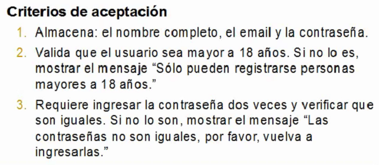
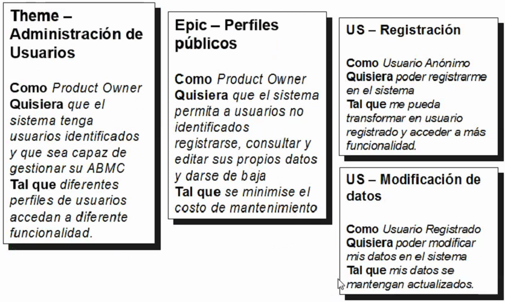

# User stories

## Como plasmar los requerimientos

### User story

Un usuario cuenta como quiere usar un programa, define criterios de aceptación

**Como** [Un rol específico]

**Quisiera** [Funcionalidad]

**Tal que** [Valor para el negocio]

Ejemplo

**User story:** 1.4 - Registración

**Como** usuario anónimo

**Quisiera** poder registrarme en el sistema

**Tal que** me pueda transformar en usuario registrado y acceder a más funcionalidad

Cuando el sistema es muy grande, una user story brinda demasiado detalle como para tener una visión general.

**Theme** &rarr; **Epic** &rarr; **User story**

### Requerimientos no funcionales

No son en si mismos una user story, pueden ser partes de los criterios de aceptación.

Por ejemplo: tiempo de respuesta de la interfaz, base de datos, navegadores soportados, etc.

Done criteria != Criterios de aceptación

Un criterio de aceptación es parte de una user story en particular, pero done criteria son pasos por lo que debe atravesar cada una de las user story.