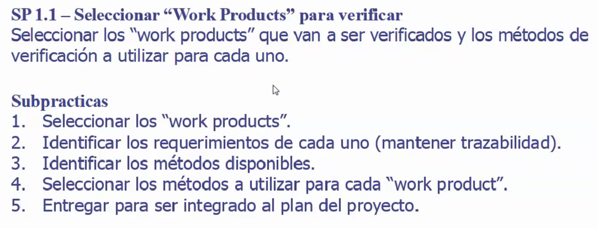
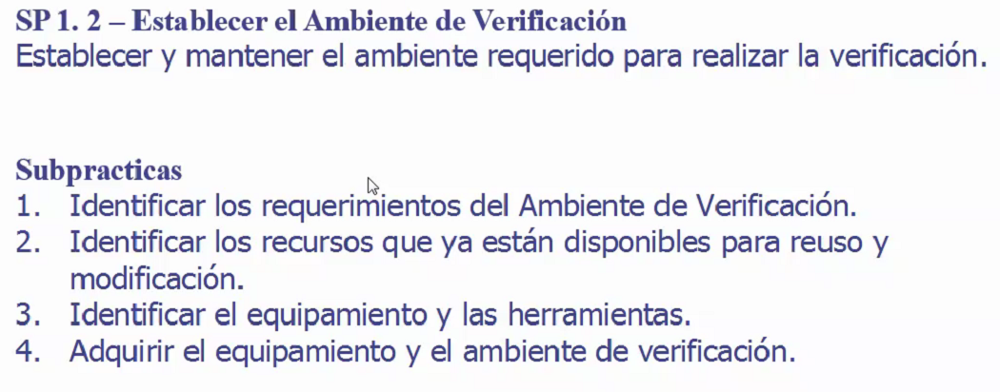
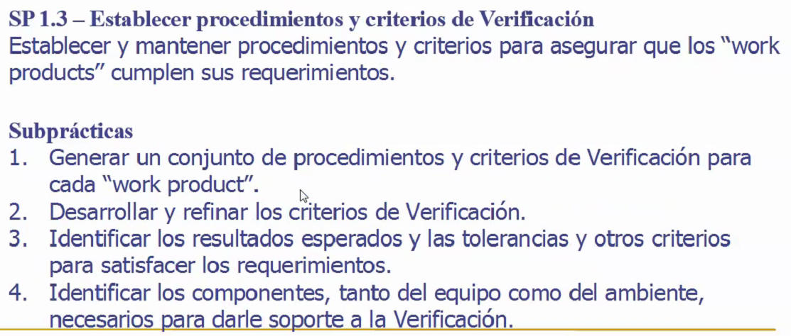
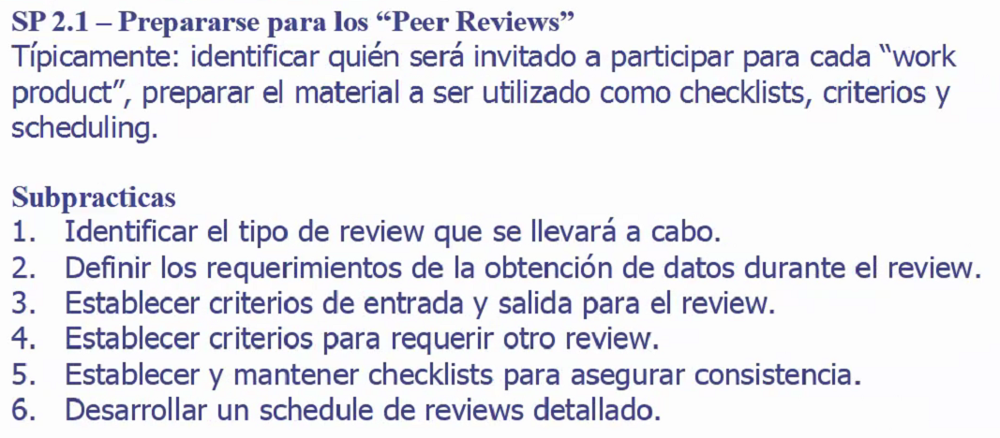
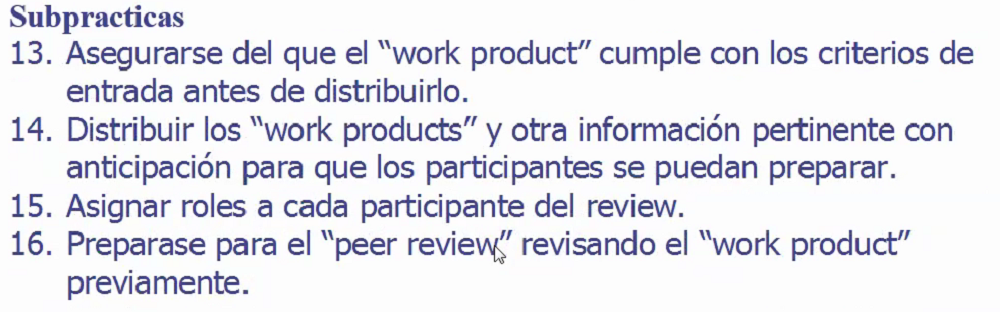
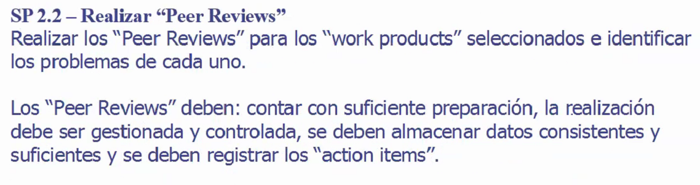
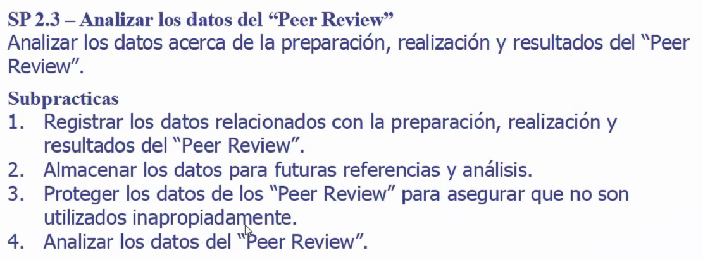
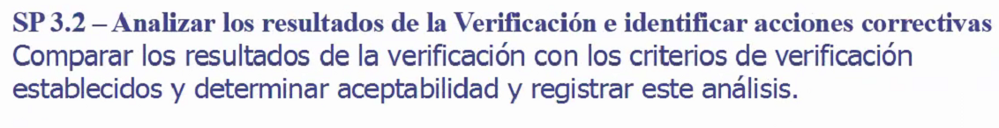
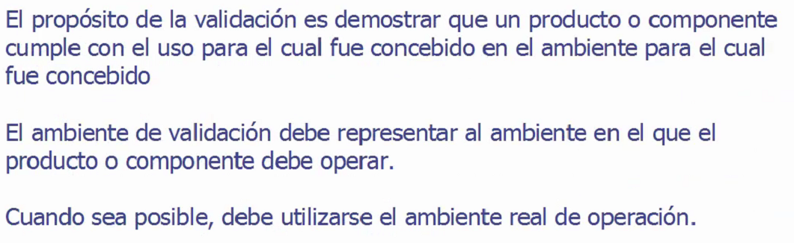

# Verificacion y validación

## Verificación

Estamos construyendo el producto correctamente?

### Seleccionar Work Products para verificar

### Establecer el ambiente de verificación

### Establecer procedimientos y criterios de verificación

### Prepararse para realizar peer reviews

### Realizar peer reviews

Verificar que no halla problemas en realizar peer reviews. De lo contrario resolverlos para facilitar futuros peer reviews.

Asegurarse que fue realizado de la manera correcta.

## Validación

Estamos construyendo el producto correcto? Sirve para su uso pretendido?

**Smoke test:** probar los features que se consideran más relevantes
