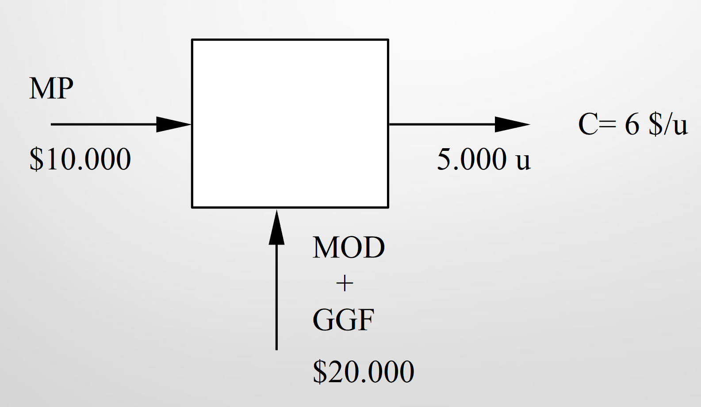

# Costos

Clasificar lo que se gastó. Asignarlo a cada proceso y distribuirlo.

Centro de costo (ceco): todas las áreas tienen centros de costos.  
En actividades comerciales, también hay centros de beneficio (cebe), porque tienen ventas. Pero las actividades de tecnologías y servicios solo tienen cecos

## Determinación de costos

### Según del momento de su determinación

- Histórico o reales: información que se tiene del pasado
- Predeterminados / Estimados estándar: estimación de lo que podría costar

### Según el tratamiento de los gastos fijos

- Costeo por absorción: se incluyen los costos fijos a cada proyecto
- Costeo directo: se costea cada proyecto por separado y los costos fijos se agregan al final.

### Según las características del proceso

- Por orden de trabajo o por lote / proyecto
- Por proceso / área

## Graficación de procesos

Unidades que ingresan: &rarr; a la izquierda  
Unidades que egresan: &rarr; a la derecha  
Procesos que se realizan al principio de producción: flecha al principio del cuadrado.  
Procesos que se realizan durante la producción: flecha al medio del cuadrado.  
Procesos al final de la producción: flecha al final del cuadrado.  

## PPP vs FIFO

Tengo 100 unidades a 50% del mes anterior ($10000 en MP)
Termino 200 unidades este mes, gastando $12000 en MP

Por PPP el costo de MP sería

($10000 + $12000) / 200u = $110/u

Por FIFO el costo de MP sería

Unidades mes anterior: $10000 / 100u = $100/u
Unidades mes actual: $12000 / 100u = $120/u

