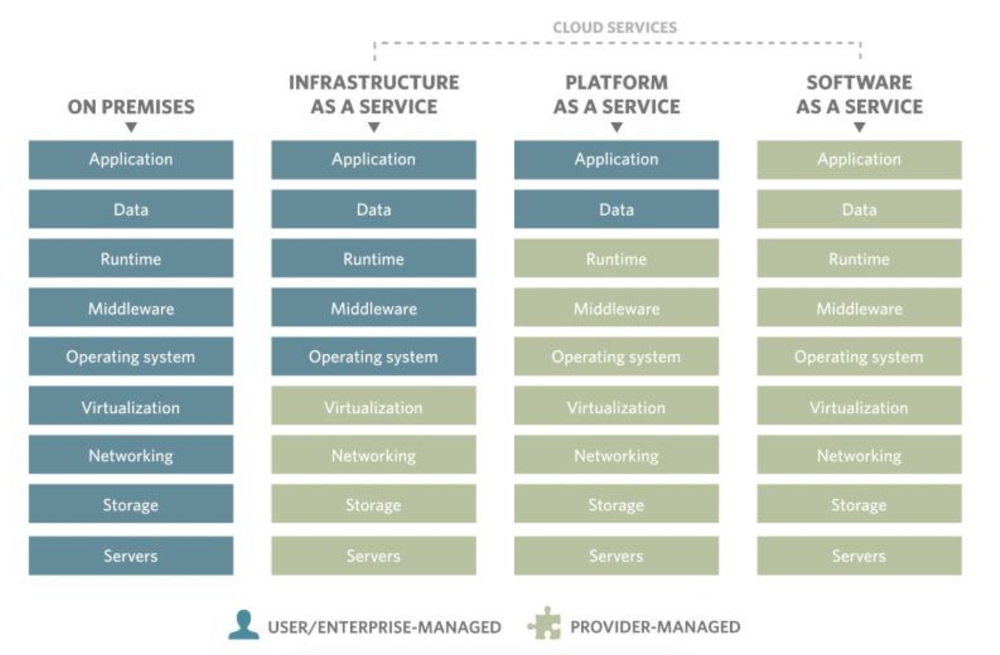

# Sistemas distribuidos

Definicion: conexion independiente de computadoras que se le presenta al usuario como un sistema coherentes.

Cloud computing: en el libro de tanenbaum al conectar una red al internet, la representaba en el diagrama como una nube.

**Escalabilidad**
La capacidad de crecer. Tenemos una capacidad y en el caso que sea necesario podemos aumentarla. A diferencia de un sistema que utilice muchas computadoras pero no puede agregar más.

**Disponibilidad**
Una aplicacion deberia estar disponible todo el tiempo. Una falla o la saturacion de una computadora puede afectar mi disponibilidad.

**Compartir recursos**
CPU, memoria, redes. Si no tengo capacidad en una computadora puedo utilizar la de otra que no esta ocupada.

**Performance**
El sistema se satura de tal manera que se degrada la performance. Si llega al momento de saturarse el sistema, el tiempo disponible para aumentar la capacidad durante ese problema es 0. Necesito una manera de aumentar la capacidad instantaneamente.

**Reducir costos**
Podemos ajustar nuestra capacidad on demand. Aunque comprar una computadora puede salir mas barato que contratar lo mismo en amazon, si deseo soportar los picos de carga que espero tener, voy a necesitar comprar muchas mas computadoras que lo que voy a usar en todo momento.

## Escalabilidad

### Tamaño

Recursos

- Vertical: aumentar la capacidad de la misma máquina
- Horizontal: agregas más máquinas

Usuarios

### Geograficamente

Poder crecer a nivel geografico a través del planeta. Si me expando a otros continentes voy a querer agregar máquinas mas cercanas a los clientes. Voy a necesitar una base de datos global distribuida para poder acceder a los datos desde cualquier lugar.

### Administración

Administrar todos los recursos de manera automatica. Cloud computing transformo un problema de hardware en un problema de software. Da la capacidad de manejar la infraestructura con código.

### Tecnicas de escalabilidad

**Particionar**
Por mas que replique todos los datos, si en algun momento se llena una maquina no tengo manera de continuar creciendo. Tengo que dividir los datos.

## Disponibilidad

Lograr sistemas a los que no les afecte las fallas. Las fallas siempre van a estar, pero tienen que ser transparentes al usuario, que no las vea.
Como manejar las fallas:

- Detección: chequear que los datos sean correctos antes de que los vea el usuario. Guardo cada dato con su hash y me aseguro que coincidan.
- Enmascarado: retransmisión de los mensajes
- Tolerar los errores: no puedo evitar que ocurran, pero puedo tolerarlos. Cuando se cae una máquina, levanto otra tomando los datos que estan replicados en el resto.
- Recuperación: logear las transacciones que se hicieron a disco para poder rehacerlas.

## Google vs Amazon

Los sistemas distribuidos de google se basan en la orquestración. Un director dirije el resto de los componentes.

En cambio Amazon, utiliza "coreografia", donde cada componente reacciona a lo que realiza el otro.

## Grids vs Clusters

|          Grids           |      Clusters      |
| :----------------------: | :----------------: |
| Multiples organizaciones | Misma organizacion |
|       Heterogeneo        |     Homogeneo      |

---

## EBS

Elastic Block Storage

SSD de propósito generico: tienen una cierta cantidad de operaciones por segundo permitias, pero si no se utilizan todas, se acumulan hasta un cierto máximo.

SSD IOPS: tiene una cantidad fija de operaciones por segundo.

## Elastic Capacity

**Reserved capacity:** Podemos reservar una máquina por uno o tres años y recibimos un descuento a diferencia de on demand.

**On demand:** Pagamos por hora la máquina y podemos agregar o quitar máquinas dependiendo la necesidad.

**Spot (bidding):** Amazon remata la capacidad extra que tiene osciosa. El que gana la subasta es el que mayor máximo ofrece, pero paga un precio definido actual. Conforme aumenta la demanda, comienza a pagar más, hasta llegar a su máximo ofertado. Al pasar el máximo ofertado, amazon le saca la máquina.  
Debido a la capacidad de caerme en cualquier momento, estas máquinas deben ser utilizadas para aplicacines **idempotentes**.

## Nombres de máquinas

Primero: letra

c: computo  
m: propósito general  
r: más memoria que cpu  
t: la única donde los cores del CPU son compartidos  
i: con disco local SSD

Segundo: generación (número)

## Load balancer

Se ocupa de distribuir requests entre las distintas máquinas disponibles.

**Elastic Load Balancer:** servicio provisto por AWS. Tiene un precio fijo + un precio por requests. Automáticamente agrega más máquinas para funcionar como Load Balancer. Hace Health Checks para no mandar requests a instancias caidas/problematicas.  
También nos permite utilizar varios availability zones y distribuir tráfico entre ellos.

## AutoScaling Groups

Enseñamos a Amazon como lanzar nuevas máquinas mediante una **Launch Config**. Dependiendo la demanda, puede decidir agregar o eliminar máquinas. Le damos una cantidad mínima, una cantidad deseada y una cantidad máxima.

Con Scaling Policies podemos escuchar alarmas de CloudWatch y decidir que hacer. Por ejemplo, cuando la utilización promedio de CPU es > 70% agrego una máquina, cuando pasa a ser < 40% elimino una máquina.

También se pueden distribuir los grupos en multiples availability zones (siempre dentro de la misma región), Amazon va a buscar distribuir la misma cantidad de maquinas en cada una.

---

## Niveles de servicio



## Digital Ocean

### Terraform

```terraform
    variable "digitalocean_token" {
        description = "DO TOKEN"
    }

    variable "dc" {
        description = "Datacenter"
        default = "sgp1"
    }

    provider "digitalocean" {
        token = "${var.digitalocean_token}"
    }

    resource "digitalocean_droplet" "web" {
        image = "ubuntu-18-04-x64"
        name = "web-1"
        region = "${var.dc}"
        size = "s-1vcpu-1gb"

        ssh_keys = [
            random_key
        ]

        user_data = <<EOF
        #cloud-config
        runcmd:
            - apt-get -y update
            - apt-get -y install ngix
        EOF
    }

    resource "digitalocean_loadbalancer" "public" {
        name = "loadbalancer-1"
        region = "${var.dc}"

        "forwarding_rule" {
            entry_port = 80
            entry_protocol = "http"
            target_port = 80
            target_protocol = "http"
        }

        "healthcheck" {
            port = 22
            protocol = "tcp"
        }

        droplet_ids = ["${digitalocean_droplet.web.id}"]
    }

    resource "digitalocean_record" "jcluster-lb" {
        domain = "jcluster.com"
        name = "www"
        type = "A"
        value = "${digitalocean_loadbalancer.public.ip}"
    }

    output "loadbalancer" {
        value = "${digitalocean_loadbalancer.public.ip}"
    }
```

Comandos de terraform:

- **init**: inicializa un directorio conteniendo los archivos de terraform.
- **plan**: muestra el plan a ejecutar con el script
- **apply**: aplica el plan
- **destroy**: revierte el script como si nunca hubiese sido ejecutado
