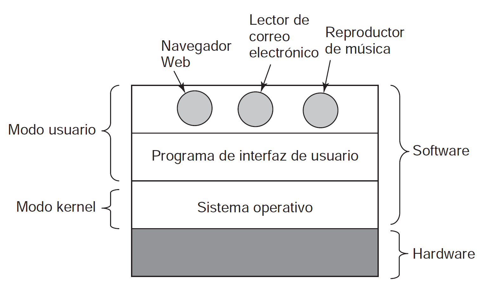

# Sistemas operativos

Todos los procesos que lanza el usuario, se ejecutan con threads en modo usuario.
En cambio los procesos que lanza el sistema operativo, se ejecutan en modo kernel. Un usuario no puede intervenir en ningún thread en modo kernel.

**Kernel**: Conjunto de programas que administran los recursos de hardware. Administra todo el hardware y provee una interfaz para interactuar con él.

## Capítulo 1

- 1.1.2
- 1.3.1 / 1.3.3
- 1.3.5 / 1.3.6
- 1.4
- 1.5.1 / 1.5.2
- 1.5.6
- Llamadas al sistema
- Api Win32
- Virtualización
  
## Tipos de sistemas operativos

- Embebidos
- Para computadoras personales
- Para servidores
- Mainframe
- Para celulares